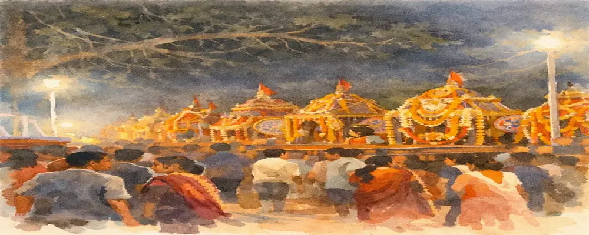
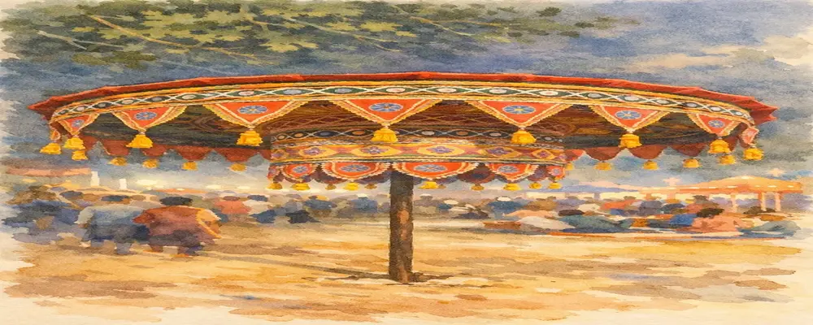
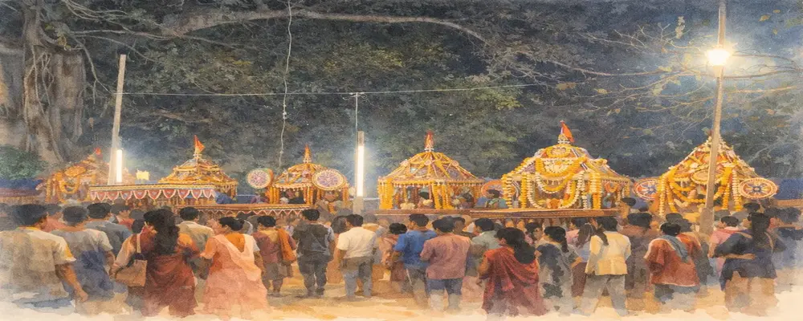

## A Festival Where God Comes to the Village

Throughout the year, devotees travel to temples seeking the presence of God.  
But in the villages of Odisha, during **Dola Jatra**, something extraordinary happens.

The deity leaves the temple, travels through the village, visits the homes of devotees, and for several days lives among the people under the open sky — as if the entire village itself has become a temple.

In this unique celebration of devotion and community, the boundary between temple and village dissolves.  
God is no longer distant within a sanctum. Instead, the deity walks among people, blesses their homes, listens to their songs, and becomes part of everyday life.

*Evening procession of Dola Govinda moving through the village.*

---

## When Is Dola Jatra Celebrated?

Dola Jatra takes place during the lunar month of **Phalguna**, marking the arrival of spring.

While the festival culminates on **Phalguna Purnima (the full moon day)**, celebrations in Odisha begin several days earlier and often continue beyond the main day.

---

## The Days Leading to the Festival

### Phalguna Shukla Dashami — Preparations Begin

The preparations begin around **Phalguna Shukla Dashami**.

During this time:

- temples prepare the idol of **Dola Govinda**, a form of Krishna worshipped during the festival  
- villagers decorate **Vimanas**, palanquin shrines resembling miniature temples  
- flowers, fabrics, and ornaments are arranged for the upcoming processions  

The anticipation builds as the village prepares for the arrival of the deity.

*Intricately decorated Chatra carrying the deity through the village.*

---

### Ekadashi to Chaturdashi — Evening Processions

For several evenings leading up to the full moon, **Dola Govinda** is taken out in procession.

The deity sits inside a decorated Vimana adorned with:

- marigold garlands  
- colorful cloth  
- ceremonial umbrellas  
- traditional ornaments  

Devotees carry the palanquin through the village while **mridanga drums, cymbals, and kirtan singing** fill the air.

One of the most emotional moments comes when the deity **visits selected homes**.

Families welcome the palanquin with lamps, incense, and offerings.  
For them, it is the belief that **God has personally come to their home**.

---

## The Offering of Mango Blossoms

A special seasonal ritual during Dola Jatra involves offering **mango blossoms (*Aam Baula*)**.

Before villagers consume the new blossoms of the season, they first offer them to Krishna.

This reflects an ancient idea:  
**the first gifts of nature must be offered to the divine before humans partake in them.**

---

## Weapon Dance and Martial Traditions

In some regions, the celebrations include traditional **weapon dances**.

Using sticks, swords, or other traditional weapons, performers enact movements symbolizing:

- courage  
- protection of the community  
- continuity of ancient traditions  

These performances bring a dramatic and energetic dimension to the festival.

---

## Phalguna Purnima — The Night of Dola Milan

The full moon marks the most important moment of the festival.

On this night, villages bring their decorated Vimanas to an open ground called the **Melana Padia**.  
This gathering is known as **Dola Milan**.

Rows of colorful palanquins stand together while villagers gather in devotion.  
Music continues through the night, and temporary markets create a vibrant atmosphere.

The gathering symbolizes **unity among villages and the meeting of divine forms**.

*Villagers gathering at the Melana Padia as multiple Vimanas come together.*

---

## Mendha Gudiya Poda — The Ritual Fire

Later that night, many villages perform **Mendha Gudiya Poda**.

An effigy made of straw and cloth is burned in a ceremonial fire.

It represents:

- the destruction of negative forces  
- purification  
- transition into spring  

Under the full moon, the fire becomes a powerful symbolic conclusion.

---

## A Festival That Continues Beyond Holi

Unlike many regions of India, Dola celebrations in Odisha often continue for several days or even weeks.

Different villages host the Melana on different evenings.  
During this time, the deity remains among the people — reinforcing the belief that:

**God lives within the village, not only within temples.**

---

## Historical Roots

The origins of Dola Jatra lie in ancient traditions celebrating the springtime play of **Radha and Krishna**.

Its present devotional form was shaped during the **Bhakti movement**, especially under the influence of **Sri Chaitanya Mahaprabhu**, who lived in Puri.

He emphasized:

- collective chanting  
- devotional music  
- community participation  

Over time, the festival merged with local traditions, creating the unique form seen in Odisha today.

---

## Where Dola Jatra Is Celebrated

While almost every village celebrates Dola Jatra, some regions are especially known:

- **Bhubaneswar (Old Town)**  
- **Villages around Puri**  
- **Jajpur and Kendrapara**  
- **Dhenkanal region**  

Each place adds its own cultural expression to the festival.

---

## For Travelers

Dola Jatra offers a rare opportunity to witness Odisha beyond its temples.

Places to experience:

- **Harirajpur** (heritage artist village)  
- **Nimapada region**  
- **Brahmagiri area**  
- **Villages around Bhubaneswar**  

These celebrations reveal a side of Odisha rarely seen in mainstream travel.

---

## A Living Cultural Idea

Dola Jatra is not merely a festival.  
It expresses a deeper idea:

**God is not distant — but lives among people.**

For a few days each year, temples open outward, and the deity walks into everyday life.

In those moments,  
**the village itself becomes the temple.**